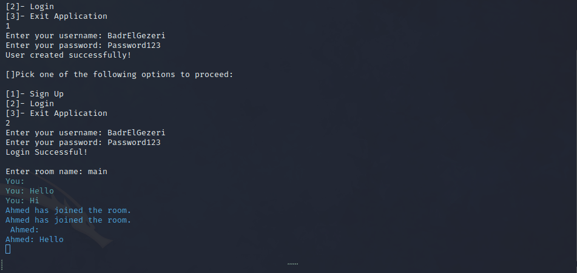

<h1>ChatApplication</h1>
 
<h1>User can close application by typing 'STOP'</h1>
<h2>Breif Introduction to the application</h2>
 

The chatting application allows users to create users and login.

The chatting application allows users to send and receive messages at the same time by utilizing threads.

<h3>Application Demo</h3>

<h3>Receiving Messages</h3>

